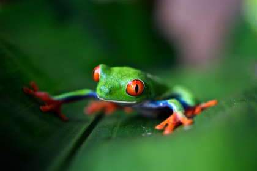
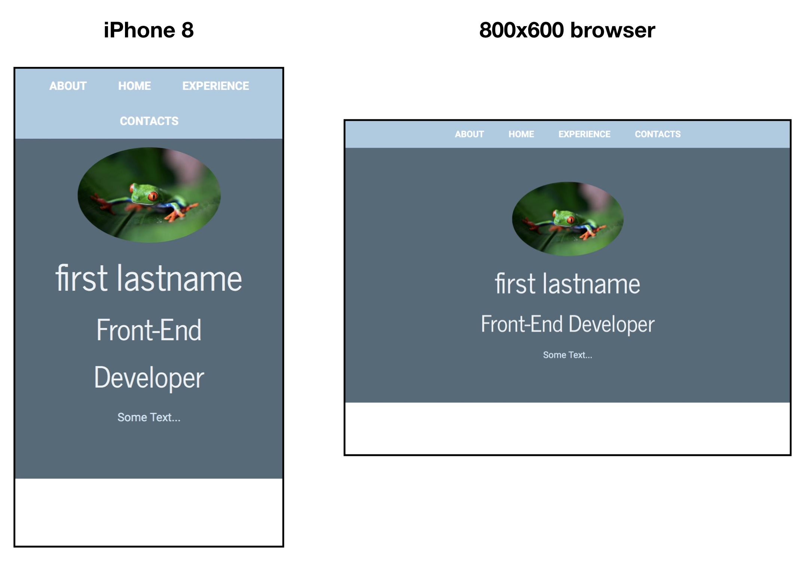

#### Example webpage

Time to tie the different concepts together. Here is an example of a top section of a webpage using [responsive design](link) the `@media section` (see link for more information). Consider the following:

```html
<!DOCTYPE html>
<html lang="en">
<head>
  <!-- Go to http://fontawesome.io/get-started/ to generate your own embed code! -->
  <script src="https://use.fontawesome.com/6e47fdd73a.js"></script>
  <meta charset="UTF-8">
  <!-- Add responsive meta-tag [read more here:https://css-tricks.com/snippets/html/responsive-meta-tag/] -->
  <meta name="viewport" content="width=device-width, initial-scale=1.0">
  <title>First Lastname | MyPage </title>
<link href="https://fonts.googleapis.com/css?family=News+Cycle|Roboto:400,700&amp;subset=cyrillic,cyrillic-ext" rel="stylesheet">
<!-- <link href="https://fonts.googleapis.com/css?family=Maven+Pro|News+Cycle" rel="stylesheet"> -->
<link rel="stylesheet" href="css/styles.css">

<body>

<header id="about">
<nav>
  <a href="#">About</a>
  <a href="#">Home</a>
  <a href="#">Experience</a>
  <a href="#">Contacts</a>
</nav>
<!-- conent wrap to center align content  -->
<div class="content-wrap">
  
  <div class="col-wide">
    <h1>first lastname</h1>
    <h2>Front-End Developer </h2>
    <p> Some Text...
  </div>
</div>

</header>

</body>
</html>
```
Use the [web developer or inspector tool](https://www.webnots.com/view-webpage-source-css-and-html-in-safari/) to inspect the different `html` elements and associated `css styles` shown below:

```css
/* Color Palette

#CEE5F2 - azureish white
#ACCBE1 - light steel blue
#7C98B3 - weldon blue
#637081 - aurometalsaurus
#536B78 - payne's grey
----------------------*/

/* Global styles
-------------------------*/
/* apply a natural box layout model to all elements, but allowing components to change */
html {
  box-sizing: border-box;
}
*, *:before, *:after {
  box-sizing: inherit;
}
body {
  /* font-family: 'News Cycle', sans-serif; */
  font-family: 'Roboto', sans-serif;
  font-weight:400;
  margin: 0;
}
h1, h2 {
  /* font-family: 'Roboto', sans-serif; */
  font-family: 'News Cycle', sans-serif;
  font-weight: 400;
}
h1 {
  font-size: 50px;
}
h2 {
  font-size: 40px;
  margin-top: 0;
}

a {
  color:white;
}
a:hover {
  text-decoration:none;
}
.content-wrap {
  max-width: 950px;
  margin: 0 auto;
  padding: 60px 50px;
  overflow: hidden;
}
.uppercase {
  text-transform: uppercase;
}

/* Header
-----------------------*/
header, footer {
  background:#536B78;
  color:#CEE5F2;
}

/* header */
header {
  padding-top: 50px;
  position: relative;
}
header h1, header h2 {
  color: #EDF2F4;
  margin: 0;
}
.profile-img {
  border-radius: 50%;
}

/* Navigation
-------------------------*/
nav {
  text-align: center;
  background: #ACCBE1;
  position: fixed;
  top: 0;
  width: 100%;
  /*z-index: 100;*/
}
nav a {
  display: inline-block;
  padding: 15px 20px;
  text-decoration: none;
  text-transform: uppercase;
  font-weight: 700;
}


/* Media Queries
-------------------------*/
@media (min-width: 900px) {
  .col-narrow {
    width: 30%;
    float: left;
  }
  .col-wide {
    width: 70%;
    float: left;
    padding-left: 20px;
  }
}
@media (max-width: 899px){
  header {
    text-align: center;
  }
  .profile-img {
    width: 200px;
  }
}
```
This will produce the following:


