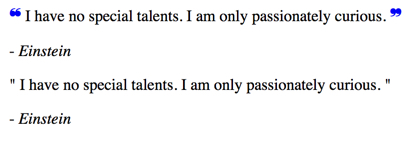

### Basic CSS guidelines

Use an external **css** document to modify multiple **HTML** files.

Always reference the **.css** in the [head](https://www.w3schools.com/tags/tag_head.asp) element of the **HTML** file:

```html
...
<head>
 <link href="_css/styles.css" rel="stylesheet">
</head>
...
```
Use `/* comments */` in _CSS_ to organize the _HTML_ sections _based on content_, group styling by content (i.e. global > specific), turn on/off styling and describe code chunks

If using external fonts, always add the `link` in the head element before the _CSS_ `link` _(use only 2 font customizations to improve load times)_


### CSS core review  

#### CSS code blocks
```css
/*  p = selector determines which html element to apply styling to */
/*  { property:value;
      } = declaration blocks contains styling rules  */

p {
  background-color: lightblue;
  color: blue;
  font-size:12px;
}
```
#### CSS selectors
Use an html element such as `h1` as a `type` selector. If it is too general (i.e. multiple `h1` elements throughout a html document) use the `class` and `id` selector attributes to provide specificity.  

```html
<tag attribute="value"></tag>  
<p class="example"></p>
<div id="example"></div>
```

| Attribute (Selector) | Rules          |
|-----------------------|---------------|
| [class](https://developer.mozilla.org/en-US/docs/Web/CSS/Class_selectors) | You define its value; Can be used multiple times per page; denoted by `.` before the selector  |
| [id](https://developer.mozilla.org/en-US/docs/Web/CSS/ID_selectors) | You define its value; Can be used **once** per page; denoted by `#` before the selector  |
| [pseudo-class](https://developer.mozilla.org/en-US/docs/Web/CSS/Pseudo-classes) | Specify state of an _HTML_ element (i.e. `a:hover` where `hover` is the state); denoted by `:` before the selector |
|[pseudo-element](https://developer.mozilla.org/en-US/docs/Web/CSS/Pseudo-elements) |  Add keyword to modify specific part of an element `p::firstline {..}` |

**Tips**: Use `type` selectors when you want multiple elements styled. Use `class` selectors for more specific styles. Use `id` for unique or global styles that are not repeated (use it primarily for in-page links).

Examples:
```css
/* Type selector  */
type_name{..}
/* Class selector: */
.class_name{..}
/* Pseudo-class selector: */
:pseudo_name{..}
/* ID selector: */
#id_name{..}

/* You can group multiple selectors to change their style */
.class_name, h2, h3 {..}

/* Use multiple selectors to add more specificity */
.class_name.class_two {..}
```

```html
<!-- Here you have two class selectors `blue & box`,
each can have their unique style properties -->
<div class="blue box"> Blue Box </div>
```
See also [object oriented css](link) overview.

#### Descendent Selectors
You can use multiple _HTML_ elements, separated by space, to select descendant elements (i.e. parent > child > descendants). **Avoid** going more then 3 elements deep (to avoid slower load times).

Consider the following:
```html
<header>                <!-- parent -->
  <h1>Heading 1</h1>    <!-- child -->
</header>
  <section>             <!-- parent -->
    <h2>Heading 2</h2>  <!-- child -->
      <p>Paragrapth with a <a href="#">link </a></p>  <!-- descendent -->
  </section>
```

To select the link in the section element above you can use multiple type selectors as depicted below (more selectors = more specificity):
```css
section p a {
  color:green;
  font-weight:600;
}
```


#### Combinators Selectors

[Child Combinator](https://developer.mozilla.org/en-US/docs/Web/CSS/Child_selectors) `>` match elements only specified by the selector followed by `>`:
```HTML
<section>
  <a href="#">child</a>
    <div>
      <a href="#">descendant</a>     
    </div>
</section>
```
```css
section a {
    /* child & descendant */
}
div > a {
    /* descendant */
}
```

[Adjacent Sibling Combinator](https://developer.mozilla.org/en-US/docs/Web/CSS/Adjacent_sibling_selectors) `+` match the second element only if it _immediately_ follows the first element.
[General Sibling Combinator](https://developer.mozilla.org/en-US/docs/Web/CSS/General_sibling_selectors) `~` match the element(s) following the first element.  
```HTML
<h1>Header</h1>
<p>Paragraph 2</p>
<p>Paragraph 3</p>
<p>Paragraph 4</p>
```

```css
h1 + p {
  /* selects paragraph 2 */
}
h1 ~ p {
  /* selects paragraphs 2-4 */
}

```

#### Psudo-Class Selectors

A psuedo-class is a keyword added to the selector after the colon symbol to specify a specific state. For example, `a:hover` would be applied only on mouse over.  

Consider the following:

| Attribute (Selector) | Rules          |
|-----------------------|---------------|
| [:first-child](https://developer.mozilla.org/en-US/docs/Web/CSS/:first-child) | modify first element among siblings |
| [:last-child](https://developer.mozilla.org/en-US/docs/Web/CSS/:last-child) | modify last element among siblings |
| [:first-of-type](https://developer.mozilla.org/en-US/docs/Web/CSS/:first-of-type) | modify first element of this type|
| [:last-of-type](https://developer.mozilla.org/en-US/docs/Web/CSS/:last-of-type) | modify last element of this type|

Some examples:
```css
h1:first-child {
  color:lime;
}
p:last-child {
  color:red;
}
p:first-of-type {
  color:blue;
}
a:last-of-type {
  color:magenta;
}
```

```html
<section>
  <h1>Heading 1</h1> <!-- this will be lime -->
  <h1>Heading 2</h1>
    <p>paragraph</p>  <!-- this will be blue -->
    <p>paragraph 2</p>    
      <a href="#">link</a>
    <p>paragraph 3</p>  
      <a href="#">link</a> <!-- this will be magenta -->
    <p>paragraph 4</p> <!-- this will be red -->
</section>
```


#### Pseudo-Element Selector

A [psuedo-element](https://developer.mozilla.org/en-US/docs/Web/CSS/Pseudo-elements) is a keyword added to the selector after _two_ colon symbols to style the elements content. For example, `p::first-letter` will style all the first-letter within the paragraph. They are not part of the [DOM](https://developer.mozilla.org/en-US/docs/Web/API/Document_Object_Model/Introduction) and are only used for presentational effects.

```css
/* pre-CSS3 */
element:first-letter {..}
/* CSS3  */
element::first-letter {..}
```

Some common pseudo-elements:

| Attribute (Selector) | Rules          |
|-----------------------|---------------|
| [::after](https://developer.mozilla.org/en-US/docs/Web/CSS/::after) and  [::before](https://developer.mozilla.org/en-US/docs/Web/CSS/::before) | must always be used with the [content](https://developer.mozilla.org/en-US/docs/Web/CSS/content) element |
| [::cue](https://developer.mozilla.org/en-US/docs/Web/CSS/::cue) | can be used to style captions and other cues |
| [::first-letter](https://developer.mozilla.org/en-US/docs/Web/CSS/::first-letter) | styles the first letter of the first line of the block-element  |
| [::first-line](https://developer.mozilla.org/en-US/docs/Web/CSS/::first-line) | styles the first line of the block-level element  |
| [::selection](https://developer.mozilla.org/en-US/docs/Web/CSS/::selection) | styles a portion of an element highlighted by the user (**experimental** [check](https://caniuse.com/#search=%3A%3Aselection) browser compatibility ) |

```css
element::before {
  content: 'hello'; /* text string */
  content: '15'; /* number string */
  content: ' '; /* no content */
  content: '©'; /* special character */
  content: '/1234'; /* unicode = https://unicode-table.com/en/ */
}
```
**Examples:**

```html
<!-- Older Browser  -->
<blockquote>
   <p class="q"> I have no special talents. I am only passionately curious. </p>
    - <cite> Einstein </cite>
</blockquote>


<!-- Newer Browsers -->
 <blockquote>
 <p> <q> I have no special talents. I am only passionately curious. </q> </p>
    - <cite> Einstein </cite>
</blockquote>
```

```css
.q::after {
  content: '\275E'; /* https://unicode-table.com/en/ */
  color: blue;
  font-size: 18px;
}

.q::before {
  content: '\275D'; /* https://unicode-table.com/en/ */
  color: blue;
  font-size: 18px;
}
```
This will produce:

