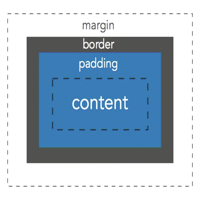
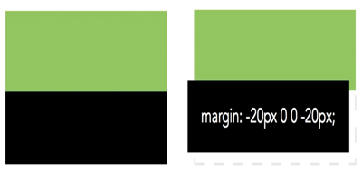
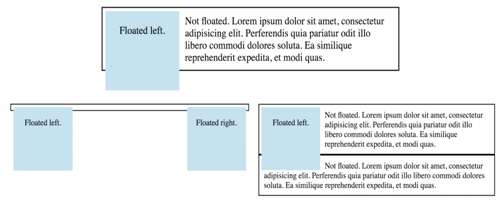
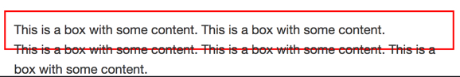
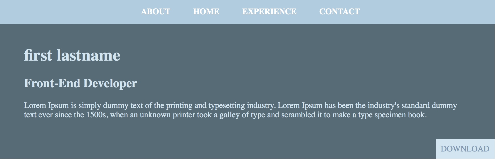

### Layouts

#### Block v. In-line Display
`Inline` elements align left, inline. `Block` elements equal 100% the width of the container.
You can use the [display](https://developer.mozilla.org/en-US/docs/Web/CSS/display) property to change the default box rendered for an element.

#### Commonly used display properties
| display property | usage |
|--------------------|-------|
| `block` | display as block element |
| `inline-block` | get characteristics of both `inline` & `block` elements; good for stacking elements next to each other |  
| `none` | hide elements; often used to hide conent until user action provided (i.e. drop down menu) |

#### Box Model
Everything in `html` is a **Box Model** that encompasses the different elements. Below are some box model properties:


You can use `px` (which offer more control) and `%` (percentages which are better suited for more responsive design; relative measure unit) to adjust the different parameters for each parameter.

| property | usage |
|--------------------|-------|
| `width` & `height` | use to change `inline` & `block` default size; **Remember** `inline` elements require the `display` property in order to change |

```css
/* inline element */
span {
  height: 100px;
  width: 100px;
  display: block;
  /* or */
  display: inline-block;
}

/* block element */
div {
  height: 100px;
  width: 100px;
}
```

| property | usage |
|--------------------|-------|
| [padding](https://tympanus.net/codrops/css_reference/padding/) | adjust the space inside the element|   
| [margin](https://developer.mozilla.org/en-US/docs/Web/CSS/margin) | adjust margin |
| [border](https://developer.mozilla.org/en-US/docs/Web/CSS/border) | adjust border |

```css
/* longhand */
.content {
  padding-top:2px;
  padding-right:2px;
  padding-bottom:2px;
  padding-left:2px;

/* short-hand */
  padding: 2px 2px 2px 2px /* top, right, bottom, left */  
  padding: 2px 2px 2px     /* top, right & left, bottom */  
  padding: 2px 5px         /* top & bottom, right & left */
  padding: 10px;           /* same on all sides */      

  /* Same above can be used for margin */

  border: 2px solid red;   /* width, style, color */

}
```
By default, block elements stack on top of each other. You can use **negative margin** to move them outside their stacking position:



Do not use this approach often. Its best to leave elements in default form.

**Tip**: Use `margin` to align entire content inside block elements.

```html
<section class="education">
  <div class="content-wrapper">
    <p> This is the the CSS education section </p>
  </div>
</section>   
```
For example, to center align all content above in the block block element use:
```css

.edcuation {
  background-color:lightblue;
}

.content-wrapper {
  width:950px
  /* Setting the margin to auto, will automatically adjust the right &
   left values. Thus, finding the center automatically */
  margin: 0 auto;
}
```
<p align="center" style="background-color:lightblue;"> This is the the CSS education section </p>

#### Floats (adjusting positioning of content)

Use the following properties to place elements along the right or left sides of a container:

| property | usage |
|--------------------|-------|
| [float](https://developer.mozilla.org/en-US/docs/Web/CSS/float) | use to change the stacking order of elements (i.e. float a picture to the left of a paragraph) |
| [clear](https://developer.mozilla.org/en-US/docs/Web/CSS/clear) | use to clear a float (i.e. if you don't want another elements contents to float next to some other element or content) |

For example, to clear the _content_ in the `heading` element so it doesn't float next to a picture:
```css  
h2 {
  float: clear both; /* to clear right and left floats */
}
```

**Parent elements don't recognize the `float` height**. See example:



To fix this use [overflow](https://developer.mozilla.org/en-US/docs/Web/CSS/overflow) property. This will _self clear_ floats.

```html
<div class="parent"> Parent Element
  <div class="floated"> Floated element </div>
</div>   
</div>
```

```css
.floated {
  float:left;
}
/* Add the overflow property to parent element  */
.parent {
  overflow: hidden;
  /* OR */
  overflow: auto;
}
```

Here is an example of say a `<div class="box"> ....</div>` that has some `height` value:



> To fix this use the `overflow` property:

```css
.box {
  border: 2px solid red;
  padding: 10px;
  height: 50px;
  /* Add Overflow */
  overflow: auto;
}
```
This will produce
<div class="box" style="border: 2px solid red; padding:10px; height:50px;overflow:auto;"> This is a box with some content. This is a box with some content. This is a box with some content. This is a box with some content. This is a box with some content. </div>  

_The `margin:auto;` will add a side bar to the box._

**Tip:** You can also use _CSS_ hacks such as [Clearfix](https://www.w3schools.com/howto/howto_css_clearfix.asp) and [Flexbox](https://css-tricks.com/snippets/css/a-guide-to-flexbox/) --- the latter is newer and is supported (at the time of this writing) by about half of the browsers. See [Can I Use](https://caniuse.com).  

#### The Box Model "Fix"
Without going into too much details, you can read more about it [here](https://css-tricks.com/box-sizing/).
Add the following to your _CSS_ to have a more _responsive_ and _fluid_ **box model**:
```css
html {
  box-sizing: border-box;
}
*, *:before, *:after {
  box-sizing: inherit;
}
```
After adding the above fix, you will need to add `div` tags with `.class_names` to your `html` elements that you want separated by columns. Then, using `<div class="col-narrow"` and `<div class="col-wide"` define the appropriate parameters for your content:

```css
/* Use % that add up to 100% to define columns */

.col-narrow {
  width:30%;
  border: 2px solid red;
  float:left;
  padding: 20px;
  min-height:220px;
}

.col-wide{
  width:70%;
  border: 2px solid green;
  float:left;
  padding: 20px;
  min-height:220px;
}
```
**Tip**: You will need to add the `min-height` to ensure the columns can fit your content. Adjust it according to your content until your columns don't overlap.  


#### Nav Element and Positioning

The [nav](https://developer.mozilla.org/en-US/docs/Web/HTML/Element/nav) is used to provide a section with navigation links `<nav>`. You can style the `nav` element either using the `display` or `float` properties (based on preference). For example:
```html
<nav>
  <a href="#">About</a>
  <a href="#">Contact</a>
</nav>
```
Apply styling (for a fixed `nav`):
```css
nav {
  text-align: center;
  background: #ACCBE1;
  position: fixed;
  top: 0;
  width: 100%;
  /*z-index: 100;*/
}
nav a {
  display: inline-block;
  padding: 15px 20px;
  text-decoration: none;
  text-transform: uppercase;
  font-weight: 700;
  color:white;
}
```
This will produce:


> Go to https://jsfiddle.net/ and try the code above.

Use [Positioning](https://tympanus.net/codrops/css_reference/position/) to override default document flow behavior. There are different types of positioning properties:

`element:static;` is the default position of the document elements.

`element:relative;` allows position to be off-set from current position. Does not remove it from natural page flow.

`element:absolute;` allows positioning relative to another element in the page. Once set, it is removed from the natural flow of the document. To bring it back to its `parent` element, set the `parent` element to `.parent {position:relative}`

`element:fixed;` allows for positioning of an element to be fixed relative to the viewport.

**Position** should not be used for changing page layouts. Instead `display` and `float` should be used.

Lets put it all together now. Consider the following (run it on https://jsfiddle.net/):

```html
<header id="about">
  <nav>
    <a href="#">About</a>
    <a href="#">Home</a>
    <a href="#">Experience</a>
    <a href="#">Contact</a>
  </nav>

<!-- conent wrap to center align conent  -->
<div class="content-wrap">
  <div class="col-wide">
    <h1>first lastname</h1>
    <h2>Front-End Developer </h2>
      <p>
  Lorem Ipsum is simply dummy text of the printing and typesetting industry. Lorem Ipsum has been the industry's standard dummy     text ever since the 1500s, when an unknown printer took a galley of type and scrambled it to make a type specimen book.
      </p>

    <a href="DownloadFile.doc" class="btn" download >Download</a> <!-- add the `download` attr to start download automatically-->
  </div>
  </div>
</header>
```
Here, we use the `fixed` position for the `nav` element, `relative` for the `header` element (must be done to keep the _download button_ in the natural doc flow) and the `.btn` class as `absolute`.

```css
header {
  background:#536B78;
  color:#CEE5F2;
  position:relative; /* this needs to be set to keep the
  download button in the natural doc flow */
}
nav {
  text-align: center;
  background: #ACCBE1;
  position: fixed;
  top: 0;
  width: 100%;
}

nav a {
  display: inline-block;
  padding: 15px 20px;
  text-decoration: none;
  text-transform: uppercase;
  font-weight: 700;
  color:white;
}

.content-wrap {
  max-width: 950px;
  margin: 0 auto;
  padding: 60px 50px;
  overflow: hidden;
}

.btn {
  padding:10px;
  background:#CEE5F2;
  color:#7C98B3;
  text-transform:uppercase;
  text-decoration:none;
  position:absolute; /* this is relative to the header element,
  which needs to have pos:relative; */
  bottom:0;
  right:0;
}
```
This will produce:



#### Recommendations on Float, Display and Position

**Float**: use it for flexible conent (e.g., image surrounded by text or blog posts of varying lengths); Use in global elements (e.g., header, footer, sidebar).

**Display**: use it for aligning page contents (e.g., such as center aligning content of child elements); Remember it does not change the natural doc flow or stacking order.

**Position**: use it when elements need to be position relative to another elements; can be use to align elements outside of document flow (e.g., navigation bar) or a specific spot in a document (e.g., as demonstrated in the above example)

>Choose one option for one element. If position used, float is ignored. If float used, display is ignored. Used background color while working with these.

Consider reviewing the [z-index](https://developer.mozilla.org/en-US/docs/Web/CSS/z-index) to change the order of `elements`. It is mostly useful for ensuring an element is always displayed above all other elements (i.e. such as a menu bar).

**TIP**: Browsers will sometimes overwrite certain sections of your stylesheet. To avoid this you can create a pre-written stylesheet that will override default stylesheets of browsers. See [normalize](https://necolas.github.io/normalize.css/)
