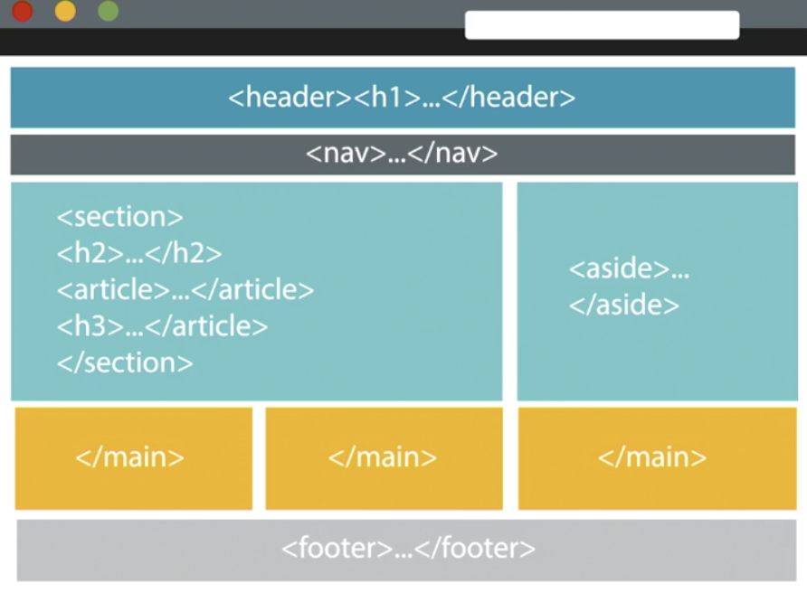

### Basic HTML structure
```html
<!doctype  html>   <!--Define document as HTML type-->
<html lang="en">  <!--Tell browser content is in english-->
  <head>         <!--Head section provides page description, including functional info-->
    <meta charset="utf-8">
    <meta name="description" contents="A template html page">
    <title> Basic HTML template </title>
    <link href="_css/styles.css" rel="stylesheet" type="text/css"> <!--link to CSS style information-->  
  </head>

  <body>          <!--Body section contains main webpage content-->   
    ### Sectioning and Semantic Elements ###
        "page content"
  </body>

</html>
```
###  Sectioning Elements
> Below are some commonly used sectioning elements that can be used to provide additional context to a webpage:  

```html

<!--Section headers, keep them in consecutive order-->
 <h1> .. <h6>

<!--Think of it as "articles" of clothing, even if removed still are a
standalone item-->
 <article>  

<!--Should be tangentially related to parent content, can be within a section or
vice versa-->
 <aside>  

<!--Navigation element that provides links to other webpage content within or
outside the webpage-->
<nav>

<!--Thematic grouping of content (based on context), usually by including
headings-->
<section>

<!--Used for grouping content, such as when styling content. It should only
be used when no other elements is available to define content-->
<div class="book" lang="eng" id="unique">  
```

For additional information for each section element see links:
 [article](https://www.w3schools.com/tags/tag_article.asp), [aside](https://www.w3schools.com/tags/tag_aside.asp), [nav](https://www.w3schools.com/tags/tag_nav.asp), [section](https://www.w3schools.com/tags/tag_section.asp), [div](https://www.w3schools.com/tags/tag_div.asp).

### Semantic Elements
> Used to add additional structure and meaning to document.

```html
<!--Used define introductory or navigational aids; can be used in multiple
location of a document-->  
<header>

<!--Has to be unique, main content of a page; not a sectioning element nor
 has effect on doc outline; useful for screen readers, search engines, etc
 that need to know what the "main" content is-->
<main>


<!--Extra information that may be useful such as copyright info,
links to additional info, etc-->
<footer>
```

For additional information for each section element see links:
 [header](https://www.w3schools.com/tags/tag_header.asp), [main](https://www.w3schools.com/tags/tag_main.asp), [footer](https://www.w3schools.com/tags/tag_footer.asp).

#### Example of webpage sectioning:  
> Providing sectioning information is critical for computers to process your
website information.


